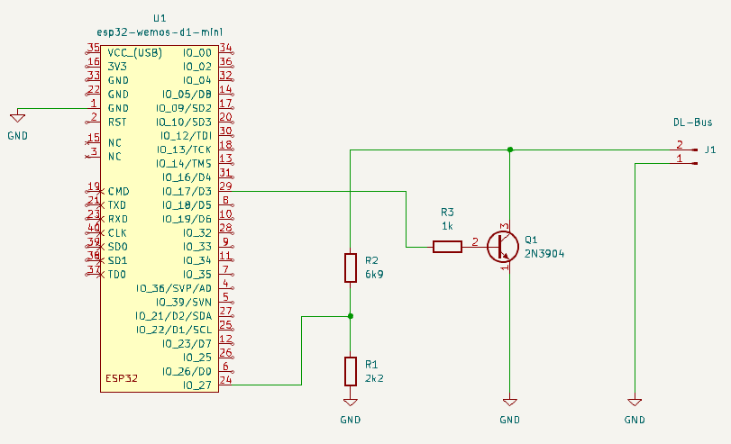

# sensordlbus
ESPHome Component and Home Assistant integration for DLbus of Heating Controller UVR67 from "Technische Alternative"

## 🎯 Overview

This KiCad project provides a simple hardware interface for communicating with DLbus devices. It has been tested with the UVR67 controller and has been running flawlessly for years.


[Dokumentation Schematic](schematic)

## ⚠️ Warning

The hardware design is intentionally kept as simple as possible, using components that were available at hand. **It does not include protection components against EMV (electromagnetic interference) or overvoltage.** Use at your own risk in non-critical applications.

## ✅ Tested Hardware

- **UVR67** - Multiple years of stable operation
- UVR1611 - should work, minor changes maybe needed
- Room temperature sensor RAS-DL

## Features

- Interrupt-driven acquisition
- read Datalogframe from UVR67 (UVR1611)
- read Temperature sensors
- read Outputs
- simulate Room temperature sensor RAS-DL
- control Heatingmode in UVR
- send Roomtemperature to UVR

## Todo
- integrate other DLBus-Masters
- integrate more logging values from UVR1611

## 📁 Project Contents

- Arduino-lib for ESP32 (DLBus)
- ESPhome-Component with integration for Home Assistant
- KiCad schematic files

## Installation on Home Assistant

- Enable Datalogging to DLbus in UVR67
- Build ESP32 with DLbus-interface (bare minimal schematic included, read warning!)
- integrate your ESP32 into Home Assistant/ESPhome (there are other tutorials, which cover this step)
- add this to your yaml-config in ESPhome Builder. Make sure to configure your GPIOs properly.

```yaml
sensordlbus:
  id: dlbus_component
  dlbus_rx_pin: GPIO27
  dlbus_tx_pin: GPIO17

sensor:
  - platform: sensordlbus
    sensordlbus_id: dlbus_component
    temperature_1:
      name: "Temperature 1"
    temperature_2:
      name: "Temperature 2"
    temperature_3:
      name: "Temperature 3"
    temperature_4:
      name: "Temperature 4"
    temperature_5:
      name: "Temperature 5"
    temperature_6:
      name: "Temperature 6"
    output_a1:
      name: "Output A1"
    output_a2:
      name: "Output A2"
    output_a3:
      name: "Output A3"
    output_a4:
      name: "Output A4"
    output_a5:
      name: "Output A5"
    output_a6:
      name: "Output A6"
    output_a7:
      name: "Output A7"

number:
  - platform: sensordlbus
    sensordlbus_id: dlbus_component
    room_temperature:
      name: "Roomtemperature RAS-DL"

select:
  - platform: sensordlbus
    sensordlbus_id: dlbus_component
    heating_mode:
      name: "Heatingmode RAS-DL"
```

## Credits
- Company "Technische Alternative" for handing me over the Interface specification