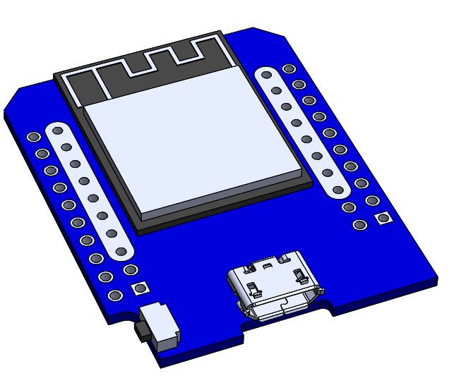

# ESP32-wemos-d1-mini kicad footprint

## Credits

-  Credits for the [original repository](https://github.com/r0oland/ESP32_mini_KiCad_Library) go to [r0oland](https://github.com/r0oland)

-  Credits for the 3D Model as well as the image above go to [Amit on Grabcad](https://grabcad.com/library/esp32-wemos-d1-mini-1)
